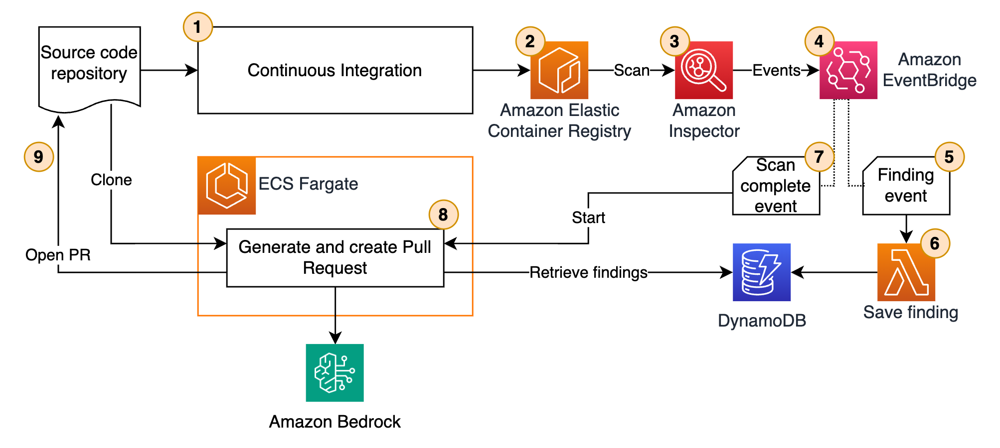
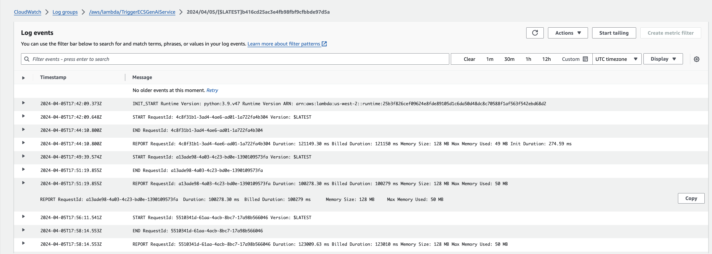
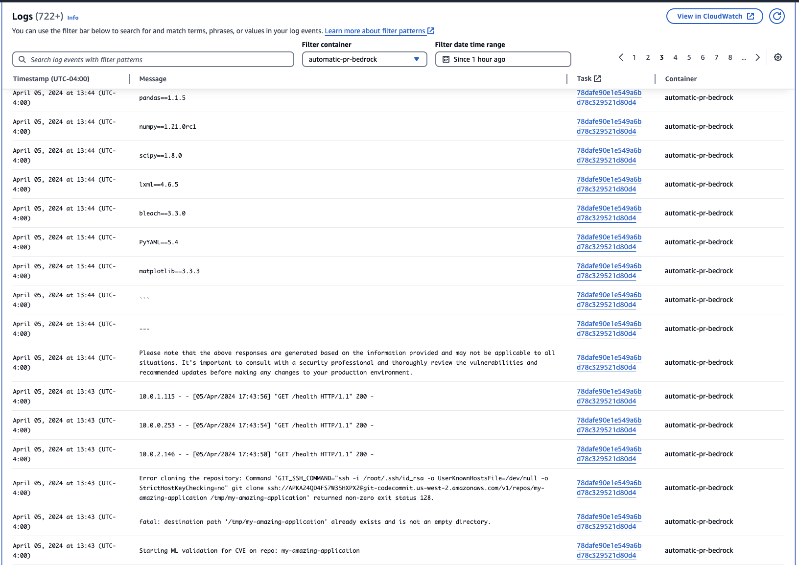

# Automated Vulnerability Patching for Secure Application Development

This repository introduces an innovative automated remediation pipeline, designed to effectively address vulnerabilities detected by AWS ECR Inspector. By leveraging Generative AI through Amazon Bedrock's in-context learning, this solution significantly enhances the security posture of application development workflows.

## Overview

Our architecture seamlessly integrates with CI/CD processes, offering a comprehensive and automated approach to vulnerability management. The architecture diagram provided illustrates the solution's key components and their interactions, ensuring a holistic vulnerability remediation strategy.



## Pipeline Workflow

1. **CI Pipeline Integration**: Begins with cloning the Application Repo, proceeds with static code analysis and image building, and concludes with image scanning using Trivy before pushing to ECR. (TBD)
2. **ECR and Inspector Evaluation**: ECR stores the Docker images, which are then scanned by AWS Inspector for vulnerabilities, categorized by severity.
3. **Lambda Functions**:
    - **Aggregate Inspector Findings**: Collects data from AWS Inspector and stores it in DynamoDB.
    - **Trigger Gen AI ECS Service**: Initiates the Generative AI ECS service for patch suggestion.
4. **ECS and Fargate with Amazon Bedrock**: Deploys the application in ECS using Fargate to generate pull requests with fixes for the identified vulnerabilities, leveraging Amazon Bedrock's in-context learning.
5. **EventBridge Rules**: Implements rules to activate Lambda functions based on specific Inspector2 Scan events indicating scan completion.

## Objective

Automate the vulnerability remediation process, minimizing manual intervention by automatically suggesting and applying fixes for security issues identified by ECR Inspector.

## Deployment Guide

### Prerequisites

Export environmental variables for AWS region and account ID:

```bash
export BASE_PATH=</path/to/your/project>
export AWS_REGION="$(aws configure get region)"
export ACCOUNT_ID="$(aws sts get-caller-identity --query Account --output text)"
```

Generate SSH keys for the automatic PR application:

```bash
ssh-keygen -t rsa -b 4096 -C "your_email@example.com" -f ${BASE_PATH}/automatic-pr-bedrock/keys/cve_demo
```

### Terraform Configuration

1. Adjust Terraform variables in `terraform-new/variables.tf` to suit your deployment needs.

2. Initialize Terraform and plan your deployment:

    ```bash
    cd ${BASE_PATH}/terraform/
    terraform init
    terraform plan
    ```

3. Apply the Terraform configuration:

    ```bash
    terraform apply --auto-approve
    ```

4. Export the `USER_ID` from the `codecommit_user_ssh_key_id` terraform output:

    ```bash
    export USER_ID=$(terraform output -raw codecommit_user_ssh_key_id) 
    echo $USER_ID
    APKA1234567890ABCDEF
    ```

### CodeCommit Repository Preparation

1. Add the generated SSH key to your ssh-agent:

    ```bash
    eval "$(ssh-agent -s)"
    ssh-add ${BASE_PATH}/automatic-pr-bedrock/keys/cve_demo
    ```

2. Clone the CodeCommit repositories using SSH URLs obtained from Terraform outputs at the root of your `BASE_PATH`.

    ```bash
    cd ${BASE_PATH}
    git clone ssh://${USER_ID}@git-codecommit.${AWS_REGION}.amazonaws.com/v1/repos/my-amazing-application
    git clone ssh://${USER_ID}@git-codecommit.${AWS_REGION}.amazonaws.com/v1/repos/my-awesome-application
    ```

3. Copy the `my-amazing-application` files into the cloned repositories and push the changes.

    ```bash
    cd ${BASE_PATH}
    cp -r ${BASE_PATH}/apps/my-amazing-application/* my-amazing-application/
    cd my-amazing-application/
    git add .
    git commit -m "Initial Commit"
    git push origin main
    ```

4. Repeat for `my-awesome-application`.

    ```bash
    cd $BASE_PATH
    cp -r ${BASE_PATH}/apps/my-amazing-application/* my-awesome-application/
    cd my-awesome-application/
    git add .
    git commit -m "Initial Commit"
    git push origin main
    ```

### Docker Image Deployment

1. Authenticate with AWS ECR:

    ```bash
    aws ecr get-login-password --region ${AWS_REGION} | docker login --username AWS --password-stdin ${ACCOUNT_ID}.dkr.ecr.${AWS_REGION}.amazonaws.com
    Login Succeeded
    ```

2. Build and push the Docker image:

    ```bash
    cd ${BASE_PATH}/automatic-pr-bedrock/

    docker build --build-arg AWS_DEFAULT_REGION=${AWS_REGION} --build-arg USER_ID=${USER_ID} -t ${ACCOUNT_ID}.dkr.ecr.${AWS_REGION}.amazonaws.com/automatic-pr-bedrock:latest .
    docker push ${ACCOUNT_ID}.dkr.ecr.${AWS_REGION}.amazonaws.com/automatic-pr-bedrock:latest
    ```

    If building using an ARM64 based processor (such as M1 based MacOS)

    ```bash
    cd ${BASE_PATH}/automatic-pr-bedrock/

    docker buildx build --platform linux/amd64 --build-arg AWS_DEFAULT_REGION=${AWS_REGION} --build-arg USER_ID=${USER_ID} -t ${ACCOUNT_ID}.dkr.ecr.${AWS_REGION}.amazonaws.com/automatic-pr-bedrock:latest --push .
    ```

## Testing and Verification

### Image Testing

Build and push a test image to trigger the pipeline:

```bash
cd ${BASE_PATH}/apps/my-amazing-application/

docker build -t ${ACCOUNT_ID}.dkr.ecr.${AWS_REGION}.amazonaws.com/my-amazing-application:latest .
docker push ${ACCOUNT_ID}.dkr.ecr.${AWS_REGION}.amazonaws.com/my-amazing-application:latest
```

### Monitoring Steps

1. **Inspector Findings**  
   Look at the Amazon Inspector Findings for the `my-amazing-application` repository.


2. **EventBridge Rule Filtering**  
   Ensure EventBridge rules are set to trigger the workflow for `CRITICAL`, `HIGH`, and `MEDIUM` severity levels.


3. **Dynamo DB entry**  
   Unsure that the entry on the `aggregate-cve-results` Amazon DynamoDB entry was created and populated with the findings.


4. **Lambda Logs**  
   Check AWS CloudWatch Logs for the Lambda `TriggerGenAIService` function.


5. **ECS Service Logs**  
   Review the Amazon ECS `cve-automatic-patching-demo` Service logs for execution details.


6. **CodeCommit PRs**  
   Inspect the CodeCommit `my-amazing-application` repository for generated pull requests.

